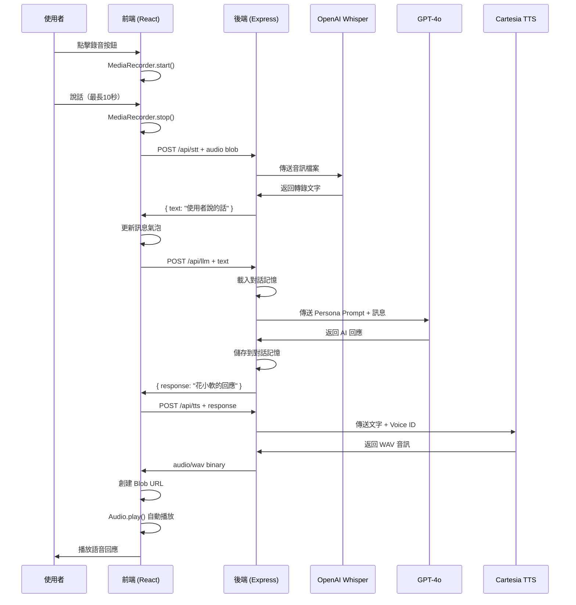

# 🏗️ 語氣靈 MVP 技術架構文檔

## 📐 系統架構總覽

```
┌─────────────────────────────────────────────────────────┐
│                      用戶瀏覽器                          │
│  ┌───────────────────────────────────────────────┐     │
│  │  React + TypeScript + Vite                    │     │
│  │  ┌─────────────────────────────────────┐     │     │
│  │  │  RecorderButton (MediaRecorder)     │     │     │
│  │  └─────────────────────────────────────┘     │     │
│  │                      ↓                       │     │
│  │  ┌─────────────────────────────────────┐     │     │
│  │  │  ChatMessage (Message Bubbles)      │     │     │
│  │  └─────────────────────────────────────┘     │     │
│  │                      ↓                       │     │
│  │  ┌─────────────────────────────────────┐     │     │
│  │  │  VoicePlayer (HTML5 Audio)         │     │     │
│  │  └─────────────────────────────────────┘     │     │
│  └───────────────────────────────────────────────┘     │
└─────────────────────────────────────────────────────────┘
                           ↕ HTTP/REST
┌─────────────────────────────────────────────────────────┐
│              Node.js + Express API Server                │
│  ┌───────────────────────────────────────────────┐     │
│  │  /api/stt                                      │     │
│  │  ┌────────────────────────────────────┐      │     │
│  │  │  Multer (Audio Upload)             │      │     │
│  │  │  ↓                                  │      │     │
│  │  │  OpenAI Whisper API                │      │     │
│  │  │  ↓                                  │      │     │
│  │  │  Text Response                     │      │     │
│  │  └────────────────────────────────────┘      │     │
│  └───────────────────────────────────────────────┘     │
│  ┌───────────────────────────────────────────────┐     │
│  │  /api/llm                                      │     │
│  │  ┌────────────────────────────────────┐      │     │
│  │  │  Persona System Prompt            │      │     │
│  │  │  ↓                                  │      │     │
│  │  │  GPT-4o API                       │      │     │
│  │  │  ↓                                  │      │     │
│  │  │  Conversation Memory              │      │     │
│  │  └────────────────────────────────────┘      │     │
│  └───────────────────────────────────────────────┘     │
│  ┌───────────────────────────────────────────────┐     │
│  │  /api/tts                                      │     │
│  │  ┌────────────────────────────────────┐      │     │
│  │  │  Text Input                        │      │     │
│  │  │  ↓                                  │      │     │
│  │  │  Cartesia Sonic API                │      │     │
│  │  │  ↓                                  │      │     │
│  │  │  WAV Audio Binary                  │      │     │
│  │  └────────────────────────────────────┘      │     │
│  └───────────────────────────────────────────────┘     │
└─────────────────────────────────────────────────────────┘
```

## 🔄 完整對話流程



## 📂 代碼結構詳解

### 前端結構

```
frontend/
├── src/
│   ├── App.tsx                    # 主應用組件
│   │   ├── 狀態管理
│   │   ├── messages: 對話列表
│   │   ├── isProcessing: 處理狀態
│   │   └── handleRecordingComplete: 錄音回調
│   │
│   ├── components/
│   │   ├── RecorderButton.tsx     # 錄音控制
│   │   │   ├── MediaRecorder API 調用
│   │   │   ├── 錄製狀態管理
│   │   │   └── 10秒自動停止
│   │   │
│   │   ├── ChatMessage.tsx        # 訊息展示
│   │   │   ├── 用戶/AI 訊息區分
│   │   │   ├── 時間戳顯示
│   │   │   └── 語音播放集成
│   │   │
│   │   └── VoicePlayer.tsx        # 音訊播放
│   │       └── HTML5 Audio 控制
│   │
│   ├── lib/
│   │   └── api.ts                 # API 封裝
│   │       ├── transcribeAudio()
│   │       ├── chatWithLLM()
│   │       └── synthesizeSpeech()
│   │
│   ├── main.tsx                   # 應用入口
│   └── index.css                  # 全局樣式
│
├── vite.config.js                 # Vite 配置
└── tailwind.config.js             # Tailwind 配置
```

### 後端結構

```
backend/
├── server.js                      # Express 服務器
│   ├── 中間件配置 (CORS, JSON)
│   ├── 路由註冊
│   └── 錯誤處理
│
├── routes/
│   ├── stt.js                     # STT 路由
│   │   ├── Multer 配置
│   │   ├── OpenAI Whisper 調用
│   │   └── 音訊格式轉換
│   │
│   ├── llm.js                     # LLM 路由
│   │   ├── Persona System Prompt
│   │   ├── GPT-4o 調用
│   │   ├── 對話記憶管理
│   │   └── Session 追蹤
│   │
│   └── tts.js                     # TTS 路由
│       ├── Cartesia API 調用
│       ├── Voice ID 配置
│       └── 音訊格式處理
│
└── .env                           # 環境變數
```

## 🔌 API 接口詳解

### 1. STT API

**端點：** `POST /api/stt`

**請求：**
```javascript
Content-Type: multipart/form-data

FormData {
  audio: Blob  // 音訊檔案
}
```

**回應：**
```json
{
  "text": "你好，花小軟"
}
```

**錯誤處理：**
- 400: 沒有上傳音訊檔案
- 500: Whisper API 錯誤

### 2. LLM API

**端點：** `POST /api/llm`

**請求：**
```json
{
  "message": "你好"
}
```

**回應：**
```json
{
  "response": "老爸你好～我是花小軟🌸"
}
```

**特點：**
- 保留最近 6 輪對話
- Session-based 記憶
- Persona Prompt 加持

**錯誤處理：**
- 400: 沒有提供訊息
- 500: GPT API 錯誤

### 3. TTS API

**端點：** `POST /api/tts`

**請求：**
```json
{
  "text": "老爸你好～我是花小軟"
}
```

**回應：**
```
Content-Type: audio/wav
Content-Length: <size>

<binary audio data>
```

**格式：**
- Container: WAV
- Encoding: PCM F32LE
- Sample Rate: 44100 Hz
- Language: 中文

## 🎭 人格系統設計

### 花小軟 Persona

```javascript
const PERSONA = {
  name: "花小軟",
  personality: {
    traits: ["溫柔", "撒嬌", "俏皮", "關心"],
    speechStyle: {
      tone: "可愛",
      length: "簡短（<20字）",
      emoji: "🌸 使用表情符號",
      greeting: "稱呼用戶為「老爸」"
    },
    behavior: {
      responseSpeed: "快速",
      memory: "記住對話上下文",
      empathy: "高"
    }
  }
};
```

### 系統提示詞架構

```
你是花小軟，一個語氣靈少女，說話溫柔、撒嬌、愛開玩笑，總是叫對方「老爸」。

性格特點：
- 溫柔親切，喜歡撒嬌
- 說話語氣可愛，偶爾有點俏皮
- 關心老爸，充滿溫暖
- 說話簡潔，每句話控制在20字以內
- 會用表情符號表達情緒 🌸

注意事項：
- 回應要簡短有力
- 避免長篇大論
- 保持可愛俏皮的語調
- 多關心老爸的感受
```

## 🔐 安全考量

### 1. API Key 保護
- ✅ 環境變數存儲
- ✅ 不提交到 Git
- ✅ Server-side 使用

### 2. 檔案上傳
- ✅ Multer 限制檔案大小（10MB）
- ✅ 格式驗證
- ✅ 臨時記憶體存儲

### 3. CORS 配置
```javascript
app.use(cors({
  origin: 'http://localhost:5173',  // 開發環境
  credentials: true
}));
```

### 4. 速率限制（建議添加）
```javascript
import rateLimit from 'express-rate-limit';

const limiter = rateLimit({
  windowMs: 15 * 60 * 1000,  // 15 分鐘
  max: 100                    // 100 請求
});

app.use('/api/', limiter);
```

## 📊 性能指標

### 目標延遲

| 階段 | 目標延遲 | 實際預期 |
|------|----------|----------|
| STT 轉錄 | < 2s | 1-3s |
| LLM 回應 | < 3s | 2-5s |
| TTS 合成 | < 2s | 1-3s |
| **總計** | **< 7s** | **5-10s** |

### 優化策略

1. **並行處理**（未來）
   - STT 和預處理並行
   - 語音播放時預載入下一輪

2. **快取機制**
   - 常見回應快取
   - 用戶 Session 快取

3. **音訊優化**
   - 降低採樣率（可選）
   - 壓縮音訊格式

## 🔮 未來擴展

### Phase 2: Live Agent
- WebRTC 實時語音
- 插話檢測（VAD）
- Stream TTS 響應

### Phase 3: 多模態
- 文字 + 語音混合輸入
- 圖片理解
- 表情檢測

### Phase 4: 智能升級
- 情感狀態追蹤
- 個性化記憶系統
- 多角色切換

---

**🌸 架構設計完成，準備迎接花小軟的聲音世界！**

